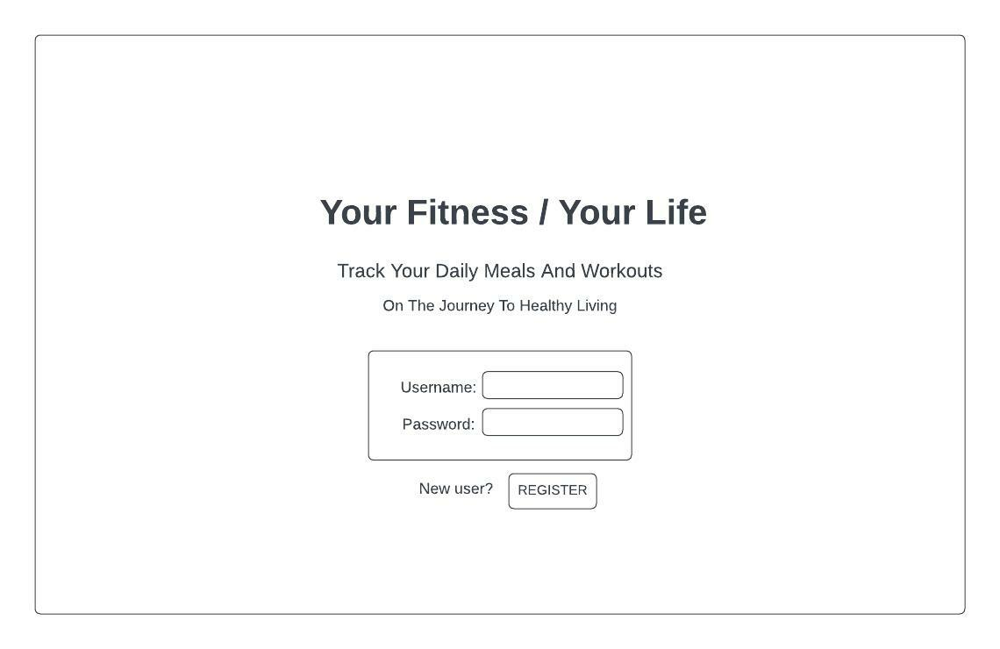
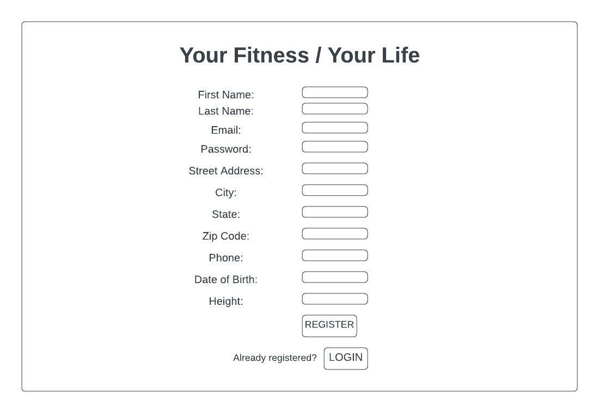
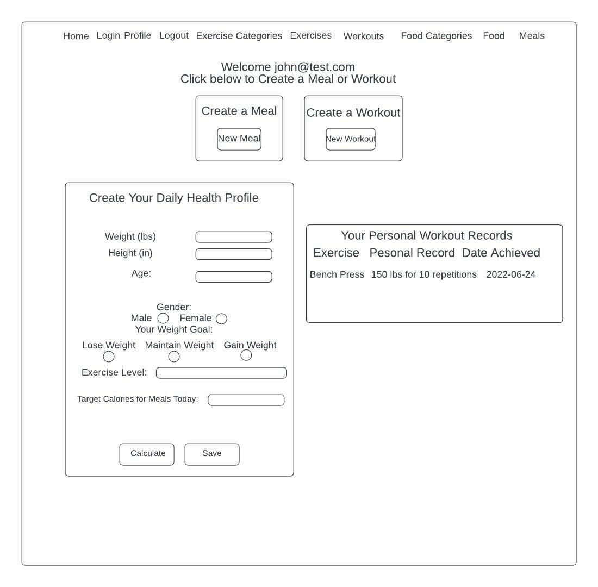
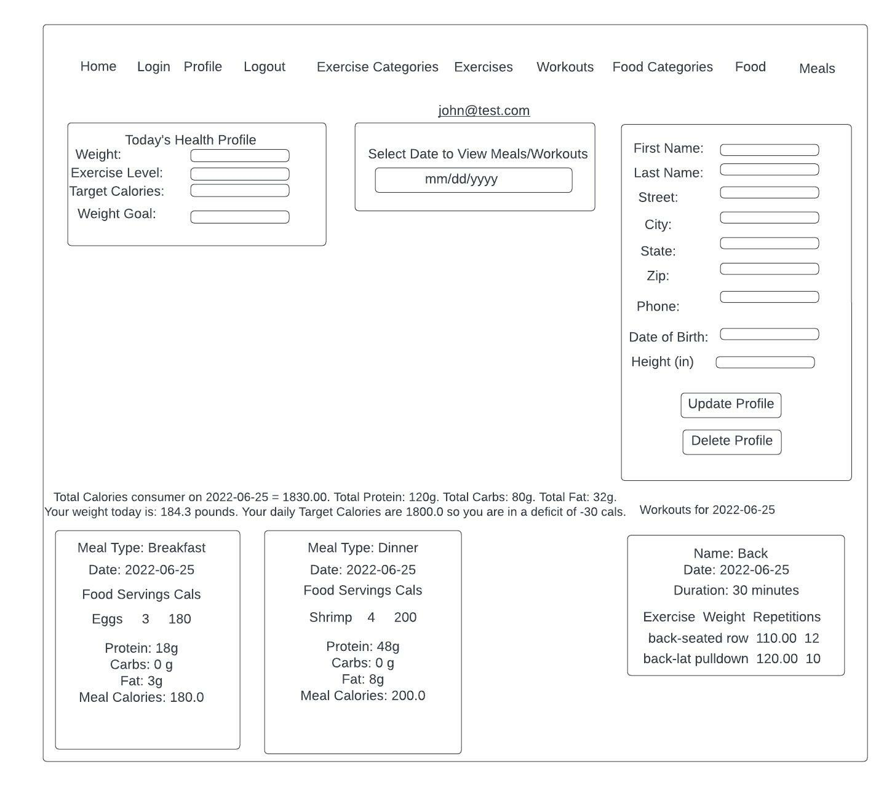
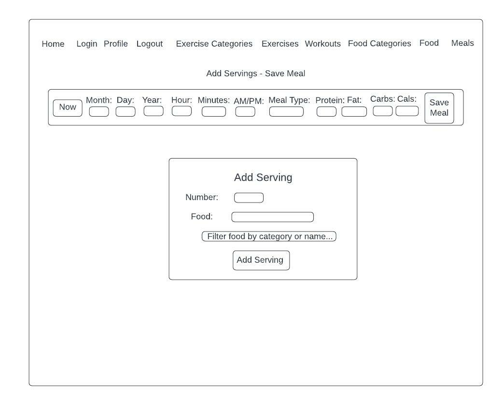
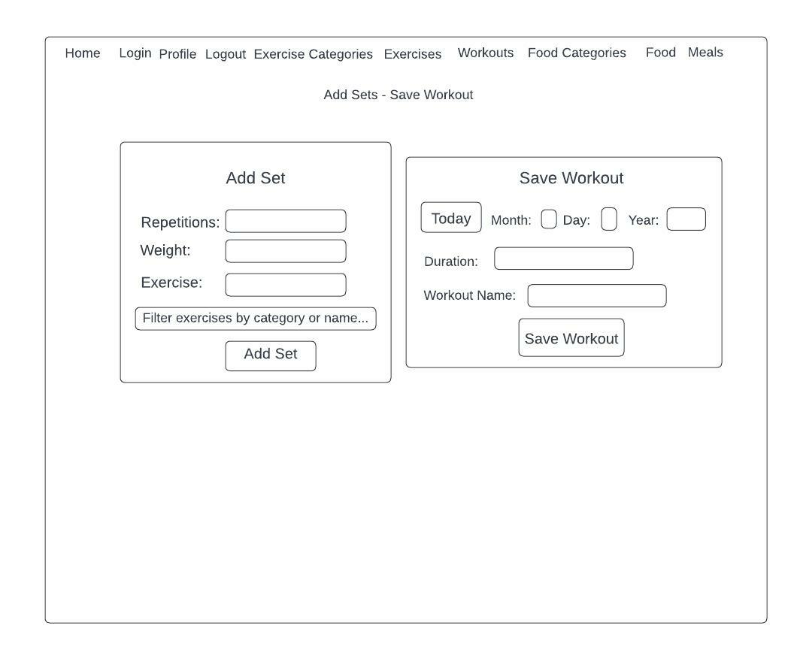

# Your Fitness / Your Life

- Fitness tracking web appliction for people serious about improving their health.
- Application tracks all aspects of User's daily food intake and exercise regimen.

## Technologies Used in Development
- Client-side: HTML, CSS, Tailwind CSS, Thymeleaf, JavaScript.
- Server-side: Java SDK 18, Spring Boot, Tomcat Server, Maven Build Tools, Spring Security.
- Data access: Spring Data JPA, MariaDb.
- SMS messaging: Twilio API.
- Version control: GitHub.

## User Flow / App Functionality
- User logs in each day and is prompted on HomePage to Create a Daily Health Profile in which they input their Current Weight, Weight Goal, and Exercise Level. 
- Daily Target Calories are calculated and User may proceed to Create a Meal or Create a Workout.
- HomePage displays User’s current Personal Records for each Exercise performed in all saved Workouts.

- To Create/Save a Meal, User creates/adds Servings of individual Food Items. Saved Servings/Meals are deletable.
- To Create/Save a Workout, User creates/adds Sets of individual Exercises. Saved Sets/Workouts are deletable.
- All Users can add any Food Items or Exercises stored in the DB regardless of which User created it.
- Users have ability to Create new Food Categories, Food Items, Exercise Categories, and Exercises.

- Profile Page allows User to select a date and view all Meal/Workout Cards pertaining to that date.
- User is shown the Total Calories, Protein, Carbohydrates, and Fat amounts consumed for all meals on the selected date. 
- User is informed if, on the selected date, fewer or greater calories than the Target Calorie amount were consumed.
- Profile Page displays Today’s weight, exercise level, target calories, and weight goal for comparison to the selected date.
- Profile Page allows User to update any data originally inputted at time of registration.  User may also delete their account.

- If User’s Daily Target Calories are exceeded (upon saving a new Meal), User receives a detailed text message containing words of encouragement within 3-4 seconds informing of same so the User can stay on track with their weight goal.
- If User achieves a new Personal Record for any Exercise (upon saving a new Workout), User recieves a detailed text message of congratulations within 3-4 seconds.

## Wireframes

 
 
 
 
 
 
